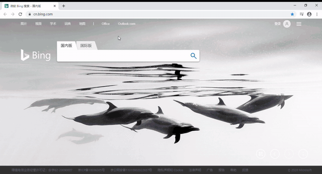

### 朗华中文手写检查

中文手写检查包括：
1. 为一个汉字的书写漂亮程度评分
2. 检查一个汉字的笔画顺序是否正确
3. 检查一个汉字的笔画数是否正确
4. 检查一个汉字每一笔的笔画方向是否正确

点击[这里](http://langhua.tech/hanzi/)在线体验。

#### 版权声明
检查所使用的核心算法库由杜彪（北大计算机86级）提供，该算法不是本项目的组成部分，版权仍归杜彪所有，特此说明。核心算法库由两个文件组成：recglib_x86.dll和hzi501.txm。

本代码的其余部分均使用Apache License V2.0，为开源软件。

#### 欢迎贡献
欢迎通过Github的Issue方式，对本项目提意见、建议、bug等。

#### 技术说明
系统开发和测试，是在Windows、JDK 8、Tomcat 8.5.x下进行。笔迹输入和汉字识别，使用了[MyScript](https://github.com/MyScript)，接口文档(OpenAPI)使用了[Swagger-UI](https://github.com/swagger-api/swagger-ui)。

#### 开发笔记
1. [前端开发](docs/front-end.md)
2. [后端开发](docs/back-end.md)
